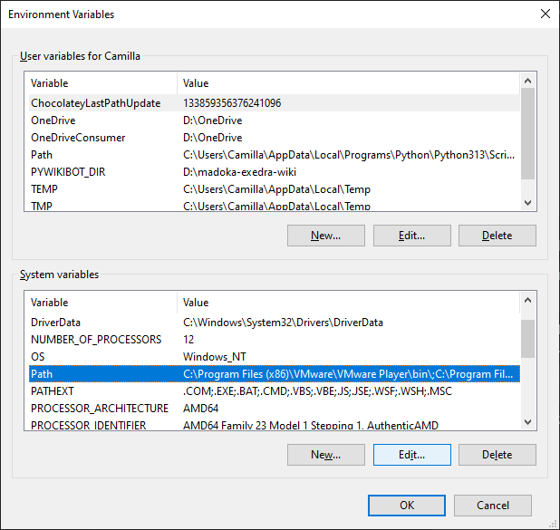
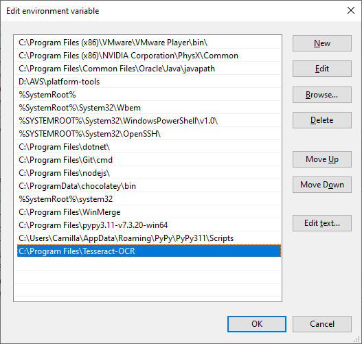
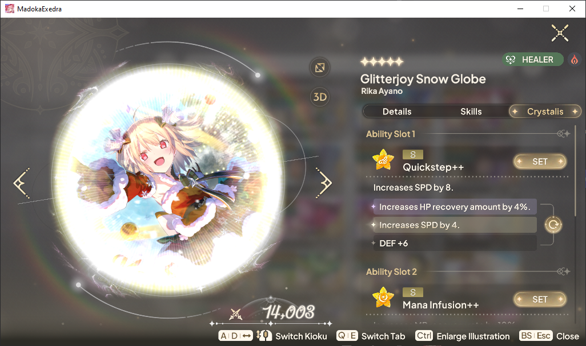
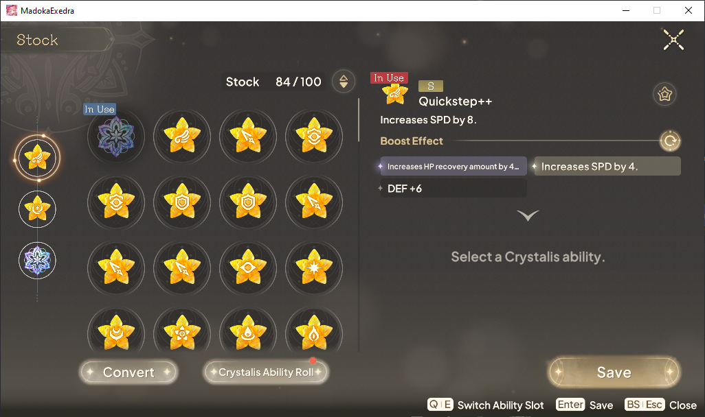

# Crystalis Reader for Exedra

## Requires

- [Tesseract OCR](https://github.com/UB-Mannheim/tesseract/wiki) installed and [added to PATH](https://gist.github.com/ScribbleGhost/752ec213b57eef5f232053e04f9d0d54). Then restart your computer
- Download the exe file of this tool from [releases](https://github.com/thefrozenfishy/crys_reader/releases)

## Usage

- This assumes your game runs in 16:9 aspect ratio.
- Start the exe on any kioku screen, be sure to be on the Crystalis tab when starting the application
  - Be sure to have crys sorted with gold at the top 
- It will run until it has mapped all crystalis for all character in your active filter.
  - **NB:** Be careful to remove filters before running this if you want _all_ characters.
  - You may quit at any time and resume later using the same output, no progress is lost.
- Import the resulting file it into [TFF's Exedra Toolbox](https://thefrozenfishy.github.io/exedra-dmg-calc/#/character-crys) to visualize the crystalis.
